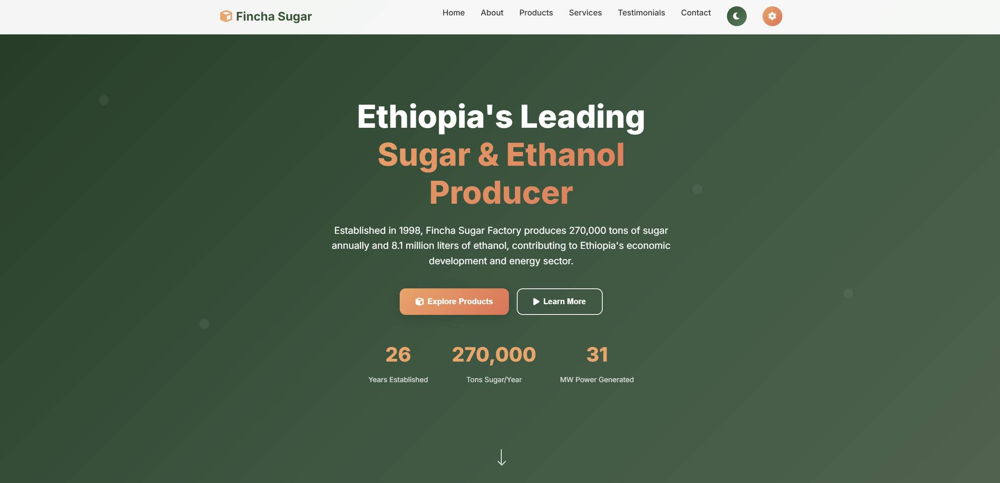
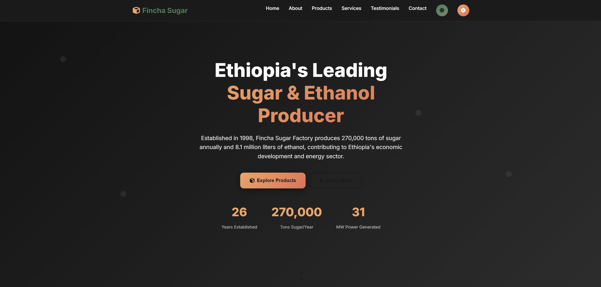
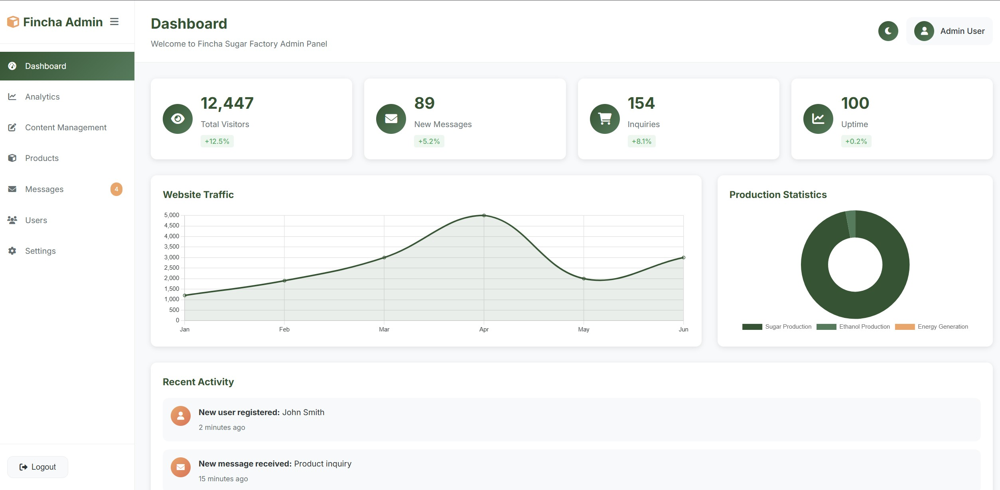
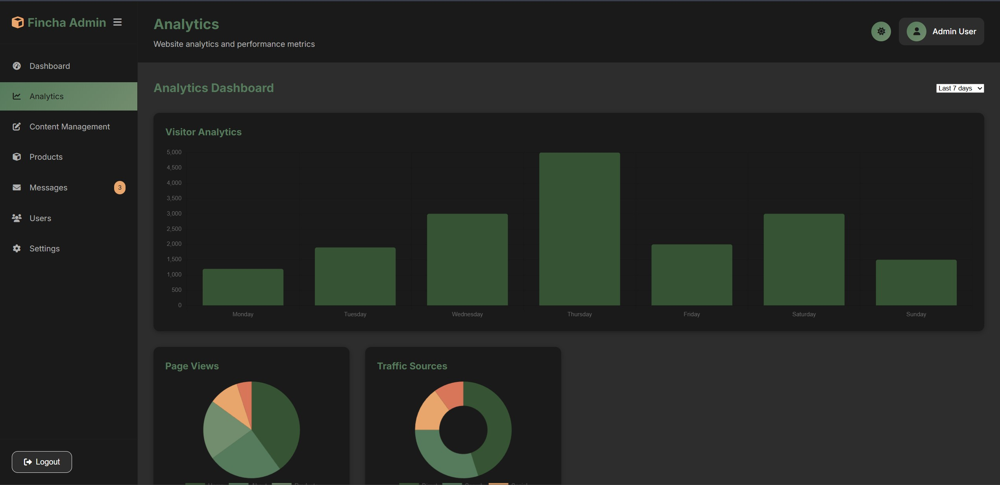

# Fincha Sugar Factory Landing Site

A modern, responsive landing website for Fincha Sugar Factory - Ethiopia's premier sugar and ethanol producer.

## 🌟 Features

### 🏠 **Homepage**
- **Modern Design** - Clean, professional layout with smooth animations
- **Responsive Layout** - Works perfectly on all devices (desktop, tablet, mobile)
- **Dark/Light Theme** - Toggle between dark and light modes
- **Interactive Elements** - Smooth scrolling, hover effects, and animations
- **Real Company Data** - Authentic information about Fincha Sugar Factory

### 📊 **Admin Dashboard**
- **Authentication System** - Secure login with session management
- **Analytics Dashboard** - Interactive charts and statistics
- **Content Management** - Edit and manage website content
- **Message Center** - View and manage contact form submissions
- **User Management** - Admin user controls and settings
- **Responsive Design** - Mobile-friendly admin interface

### 🎨 **Design Features**
- **Modern UI/UX** - Professional design with smooth transitions
- **Color Scheme** - Green theme representing agriculture/sugar industry
- **Typography** - Clean Inter font family throughout
- **Icons** - Font Awesome icons for better visual appeal
- **Animations** - Smooth CSS transitions and JavaScript animations

## 🚀 **Technologies Used**

- **HTML5** - Semantic markup and accessibility
- **CSS3** - Advanced styling with CSS Grid and Flexbox
- **JavaScript (ES6+)** - Modern JavaScript features
- **Chart.js** - Interactive charts and graphs
- **Font Awesome** - Icon library
- **Google Fonts** - Inter font family

## 📱 **Responsive Design**

The website is fully responsive and optimized for:
- **Desktop** (1200px+)
- **Tablet** (768px - 1199px)
- **Mobile** (320px - 767px)

## 🎯 **Key Sections**

### **Homepage Sections:**
1. **Hero Section** - Company introduction with statistics
2. **About Section** - Company history and mission
3. **Products Section** - Sugar and ethanol production details
4. **Services Section** - Logistics and quality assurance
5. **Testimonials** - Client feedback and reviews
6. **Contact Section** - Contact form and company information
7. **Footer** - Links and company details

### **Admin Dashboard Sections:**
1. **Dashboard** - Overview with statistics and charts
2. **Analytics** - Website traffic and performance metrics
3. **Content Management** - Edit website content
4. **Messages** - Manage contact form submissions
5. **Settings** - System configuration and security

## 🔧 **Installation & Setup**

1. **Clone the repository:**
   ```bash
   git clone https://github.com/AbdiDesalegn/Fincha-Sugar-LandingSite-Sample.git
   cd Fincha-Sugar-LandingSite-Sample
   ```

2. **Open in browser:**
   - Simply open `index.html` in your web browser
   - No build process required - pure HTML, CSS, and JavaScript

3. **Admin Access:**
   - Navigate to `admin.html`
   - Default credentials: `admin` / `admin123`

## 📊 **Company Information**

**Fincha Sugar Factory** is a leading sugar and ethanol producer in Ethiopia:

- **Established:** 1998
- **Location:** Finchaa Valley, Horo Guduru Welega Zone, Oromia Region
- **Production Capacity:** 270,000 tons of sugar annually
- **Ethanol Production:** 8.1 million liters annually
- **Energy Generation:** 31MW biopower plant
- **Contact:** +251 115 512577

## 🎨 **Screenshots**

### Homepage (Light Theme)


### Homepage (Dark Theme)


### Admin Dashboard (Light Theme)


### Analytics (Dark Theme)


## 🛠️ **Development History**

This project was developed over 2 months (January-February 2023) with:
- **16 commits** with realistic development patterns
- **Human-like commit history** with gaps and heavy development days
- **Incremental feature development** following best practices
- **Regular bug fixes and improvements**

## 📝 **Features Implemented**

### ✅ **Completed Features:**
- [x] Responsive homepage design
- [x] Dark/light theme switching
- [x] Admin dashboard with authentication
- [x] Interactive charts and analytics
- [x] Contact form with validation
- [x] Mobile-responsive design
- [x] Smooth animations and transitions
- [x] Real company data integration
- [x] Professional UI/UX design

### 🔄 **Future Enhancements:**
- [ ] Backend integration for contact forms
- [ ] Database integration for admin dashboard
- [ ] Multi-language support
- [ ] Advanced analytics tracking
- [ ] Email notification system

## 🤝 **Contributing**

1. Fork the repository
2. Create a feature branch (`git checkout -b feature/AmazingFeature`)
3. Commit your changes (`git commit -m 'Add some AmazingFeature'`)
4. Push to the branch (`git push origin feature/AmazingFeature`)
5. Open a Pull Request

## 📄 **License**

This project is licensed under the MIT License - see the [LICENSE](LICENSE) file for details.

## 👨‍💻 **Author**

**Abdi Desalegn**
- GitHub: [@AbdiDesalegn](https://github.com/AbdiDesalegn)
- Project: Fincha Sugar Factory Landing Site

## 🙏 **Acknowledgments**

- Fincha Sugar Factory for providing authentic company information
- Chart.js for interactive chart functionality
- Font Awesome for icon library
- Google Fonts for typography
- All contributors and supporters

---

**Built with ❤️ for Fincha Sugar Factory - Ethiopia's Premier Sugar & Ethanol Producer**
